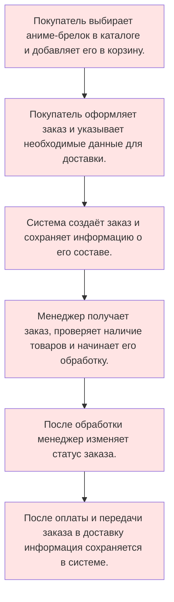

# NekoCharm :blush:

> ***Информационная система для автоматизации работы интернет-магазина аниме-брелков***

## О проекте

***NekoCharm*** — информационная система, предназначенная для автоматизации основных процессов интернет-магазина аниме-брелков.

*Система позволяет хранить и обрабатывать информацию о **товарах, покупателях, заказах, категориях и складских остатках***.

Основная идея проекта — создание единого цифрового пространства для управления товарами, заказами и работой магазина.

## Цель проекта

**Разработка информационной системы для автоматизации основных процессов интернет-магазина NekoCharm, упрощения работы сотрудников и повышения эффективности обработки заказов.**

### Основные возможности

- **Управление товарами** — добавление, редактирование и удаление товаров
- **Каталог** — просмотр и поиск аниме-брелков
- **Категории** — распределение товаров по категориям
- **Покупатели** — хранение информации о клиентах
- **Заказы** — оформление и обработка заказов
- **Склад** — контроль количества товаров
- **Оплата** — фиксация информации об оплате
- **Доставка** — хранение информации о доставке
- **Отчётность** — получение информации о продажах и заказах

## Задачи проекта

| **Задача** | **Описание** |
|---|---:|
| **Учёт товаров** | Хранение информации об аниме-брелках, их характеристиках и стоимости |
| **Каталог товаров** | Просмотр доступных товаров интернет-магазина |
| **Категории** | Распределение брелков по категориям |
| **Учёт покупателей** | Хранение контактных данных клиентов |
| **Оформление заказа** | Создание заказа на выбранные товары |
| **Состав заказа** | Хранение информации о товарах и их количестве |
| **Обработка заказов** | Изменение и контроль статусов заказов |
| **Учёт склада** | Контроль количества доступных товаров |
| **Оплата** | Фиксация суммы и способа оплаты |
| **Доставка** | Хранение информации о способе и адресе доставки |
| **Отчётность** | Формирование информации о продажах и заказах |

## Основные сущности

| **Сущность** | **Назначение** | **Основные атрибуты** |
|:---|---|---:|
| **Пользователь** | Информация о пользователе системы | ID, ФИО, email, телефон, пароль |
| **Роль** | Определение прав доступа пользователя | ID, название |
| **Товар** | Информация об аниме-брелке | ID, название, описание, цена, материал, размер |
| **Категория** | Группировка товаров | ID, название, описание |
| **Заказ** | Информация об оформленном заказе | ID, пользователь, дата, статус, стоимость |
| **Состав заказа** | Товары, входящие в заказ | ID, заказ, товар, количество, цена |
| **Склад** | Учёт количества товаров | ID, товар, количество |
| **Оплата** | Информация об оплате заказа | ID, заказ, сумма, дата, способ оплаты |
| **Доставка** | Информация о доставке заказа | ID, заказ, адрес, способ, статус |

## Роли пользователей

### **Покупатель**

- просмотр каталога;
- поиск и фильтрация товаров;
- просмотр информации о товаре;
- добавление товаров в корзину;
- оформление заказа;
- просмотр истории заказов;
- отслеживание статуса заказа.

### **Менеджер**

- просмотр заказов;
- обработка заказов;
- изменение статусов;
- добавление и редактирование товаров;
- контроль складских остатков;
- просмотр информации о покупателях.

### **Администратор**

- управление пользователями;
- управление ролями;
- управление товарами;
- управление категориями;
- контроль заказов;
- управление складскими остатками.

## Пример работы системы

## Результат

В результате разработки ***NekoCharm*** будет создана информационная система для автоматизации работы интернет-магазина аниме-брелков.

Система объединит работу с **товарами, заказами, складом, оплатой и доставкой**, а также обеспечит **разграничение доступа пользователей по ролям**.
